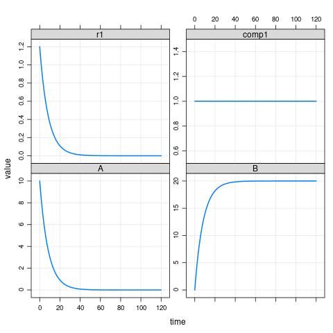

[Back to source repository](https://github.com/insysbio/heta-case-mini)

## DevOps

This is the result of output results for qsp platforms based on Heta and qs3p-js. 

These files and figures are generated by <https://travis-ci.org> each time when you update sources
in [master branch](https://github.com/insysbio/heta-case-mini).

## Results of building
- DBSolveOptimum [.SLV file](./slv.slv)
- **SBML V2L4** [.XML file](./sbml.xml), [ SbmlViewer](http://sv.insysbio.com/online/?https://insysbio.github.io/heta-case-mini/sbml.xml)
- Simbiology/Matlab [.M file](./simbio.m)
- Mrgsolve [.CPP file](./mrg.cpp)
- JSON [.JSON file](./json.json)
- YAML [.YML file](./yaml.yml)

## Results of simulations

### mrgsolve

