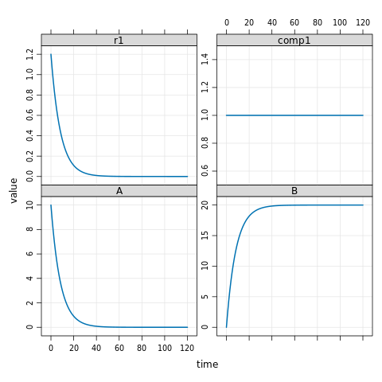

[Back to source repository](https://github.com/insysbio/heta-case-mini)

## DevOps

This is the result of output results for qsp platforms based on Heta and [Heta-compiler](https://hetalang.github.io/#/heta-compiler/). 

These files and figures are generated by [GitHub Actions](https://github.com/insysbio/heta-case-mini/actions/workflows/build-and-share.yml) each time when you update sources
in [master branch](https://github.com/insysbio/heta-case-mini).

## Results of building
- DBSolveOptimum [.SLV file](./dbsolve/model.slv)
- **SBML V2L4** [.XML file](./sbml.xml), [ SbmlViewer](http://sv.insysbio.com/online/?https://insysbio.github.io/heta-case-mini/sbml.xml)
- Simbiology/Matlab [.targ.gz arch](./simbio.tar.gz)
- Mrgsolve [.CPP file](./mrg.cpp)
- JSON [.JSON file](./json.json)
- YAML [.YML file](./yaml.yml)
- Matlab [.targ.gz arch](./matlab.tar.gz)
- Excel [.XLSX file](./table.xlsx)

## Results of simulations

### mrgsolve

